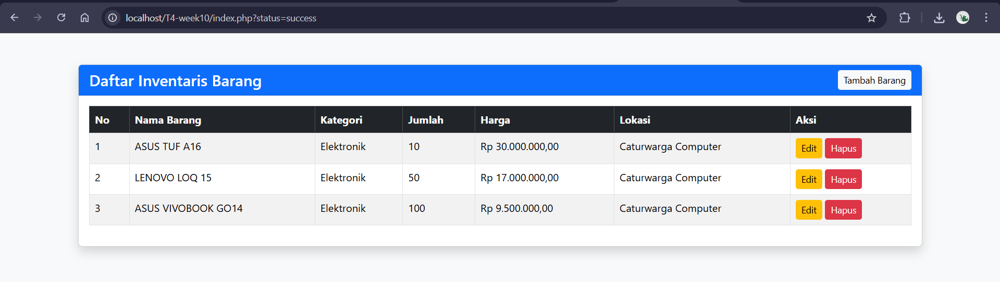
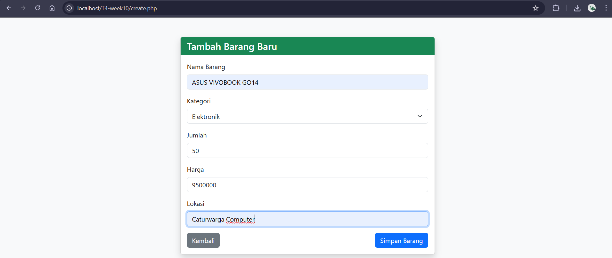
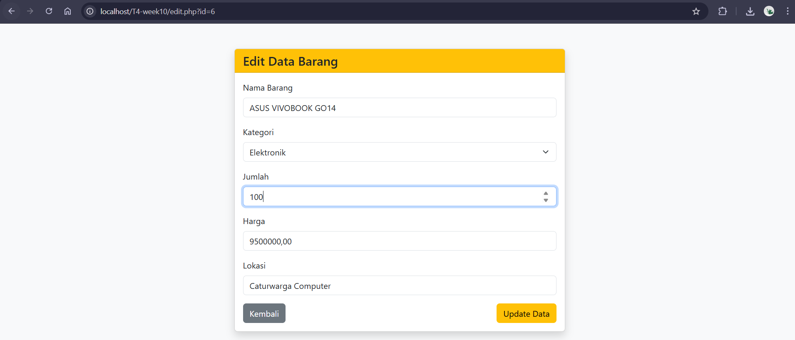
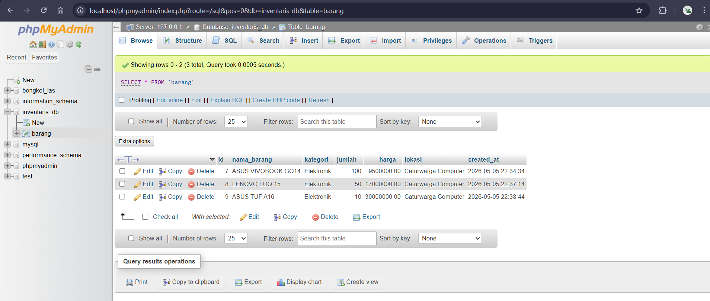

# T4-week10 - Aplikasi CRUD PHP MySQL

**Data Mahasiswa:**
- **Nama** : Ahmad Dani
- **NIM** : F1D02410140
- **Kelas** : Pemrograman Web (Teknik Informatika UNRAM)

## Deskripsi
Aplikasi CRUD (Create, Read, Update, Delete) sederhana untuk manajemen inventaris barang. Aplikasi ini dibangun menggunakan PHP native, database MySQL, dan framework Bootstrap untuk antarmuka pengguna. Keamanan aplikasi ini telah dioptimalkan menggunakan *Prepared Statements* untuk mencegah SQL Injection dan `htmlspecialchars()` untuk mencegah XSS.

- **Database** : inventaris_db
- **Tabel** : barang

## Cara Menjalankan
1. Pastikan layanan **Apache** dan **MySQL** di XAMPP sudah aktif.
2. Buat database baru bernama `inventaris_db` di phpMyAdmin.
3. Import file `inventaris_db.sql` yang tersedia di root folder project ini ke dalam database tersebut.
4. Letakkan folder project `T4-week10` ke dalam direktori `C:/xampp/htdocs/`.
5. Buka browser dan akses link: `http://localhost/T4-week10/`

## Screenshot

### 1. Daftar Data (Index)

### 2. Tambah Data (Create)

### 3. Edit Data (Update)

### 4. Struktur Database (phpMyAdmin)
<<<<<<< HEAD

=======

>>>>>>> 0d73ab30f205e1ec0a94486091b398fc7d7856b1
